# EE541_project
## Articles
### Article 1 : Analisis Perbandingan Algoritma Klasifikasi MLP dan CNN pada Dataset American Sign Language

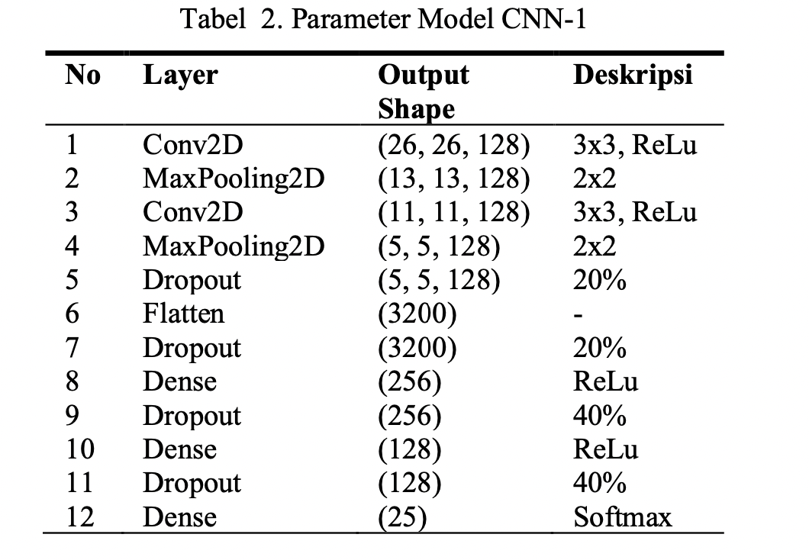

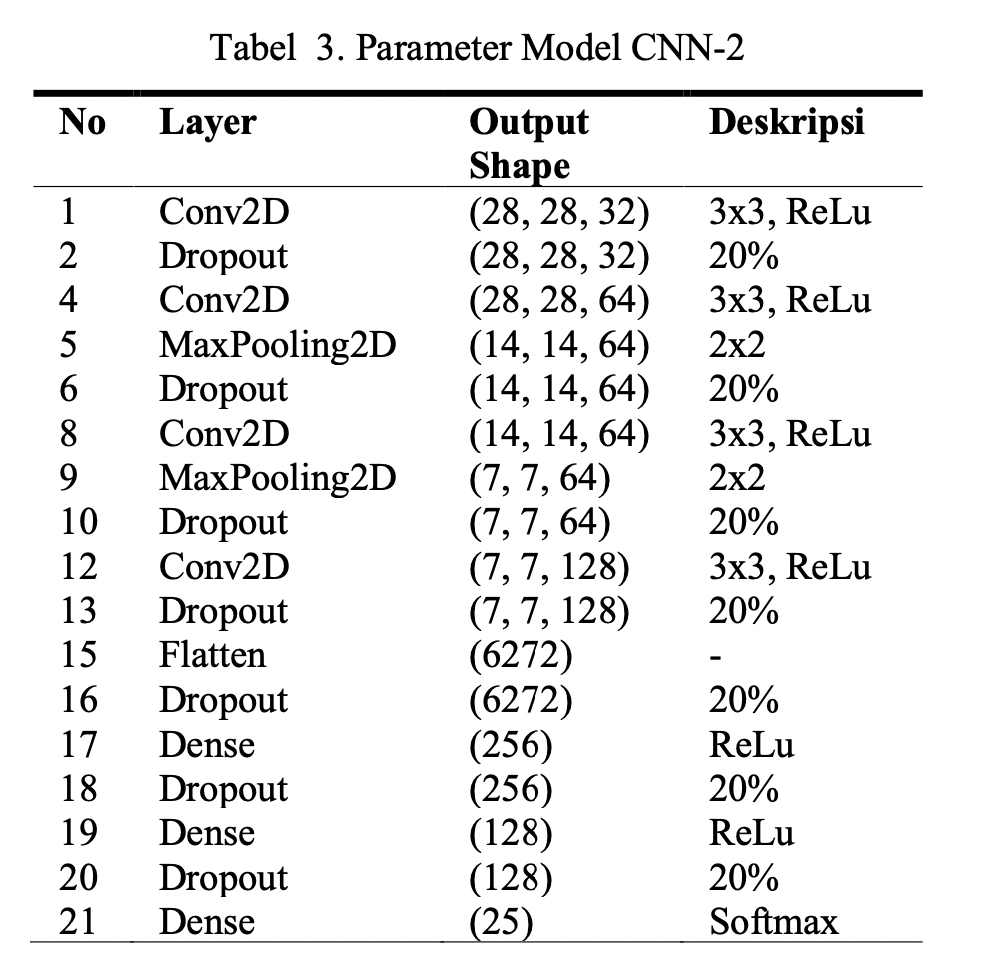

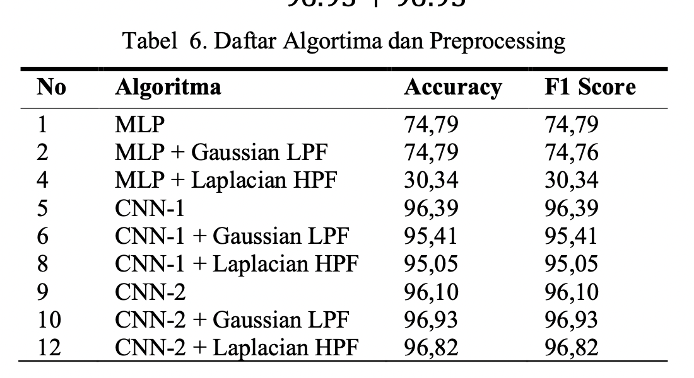

### Article 2 : Convolutional neural network with spatial pyramid pooling for hand gesture recognition
This paper outlines a convolutional neural network (CNN) integrated with spatial pyramid pooling (SPP), dubbed CNN–SPP, for vision-based hand gesture recognition.
1. use nine data augmentation to add more data

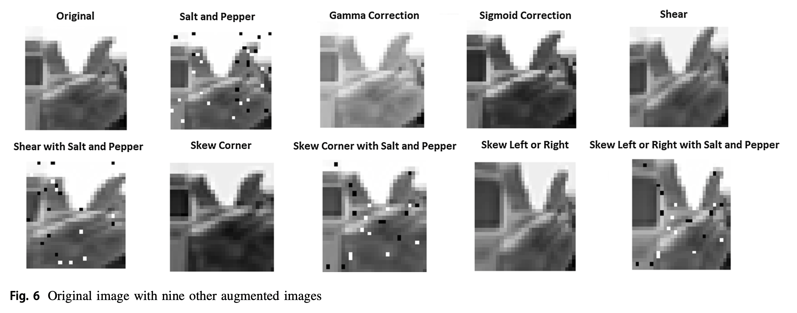

2. CNN + SPP

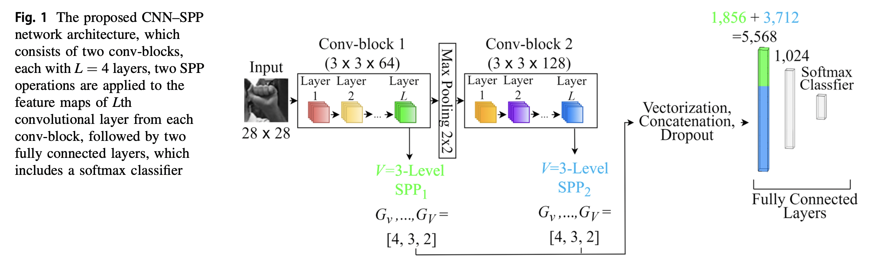

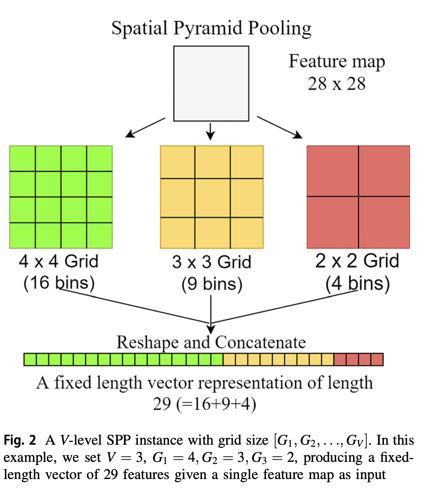

### Article 3 : A convolutional neural network to classify American Sign Language fingerspelling from depth and colour images
1. The input consists of an image of a finger sign in the form of three feature maps (YUV components, each with 32 × 32 pixels and one feature map of 32 × 32 pixels for the depth.
2. In the first stage, 64 filters (feature maps) are used, each with a 5 × 5 receptive field, no zero padding and a stride of 1, which leads to 64 planes each of dimension 28 × 28. The 64 filters are pooled by a 2 × 2 receptive field with a stride of 2, leading to 64 planes each of dimension 14 × 14. In the second stage, the 128 filters are pooled by a 2×2 receptive field with strideof2, leading to 128×5×5 planes.\
In the second stage, 128 filters with the same receptive field and stride are used, leading to an array of 128 × 10 × 10. Each single number in this dimension is squashed using a Tanh as an activation function.

3. The final layer: The 128‐dimensional feature vectors with a matrix of size 5 × 5 is reshaped to a single 3200‐dimensional vector and used as input to a two‐layer neural net with 128 nodes in the hidden layer and 24 class nodes, one for each letter.

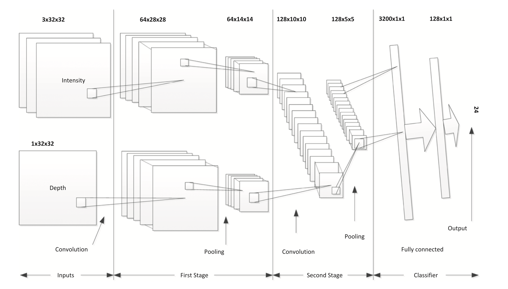

### Article 4 : Classification of Finger Spelling American Sign Language Using Convolutional Neural Network
1. There are three stages in pre-processing the first data is the resizing process, resizing is the process of changing the image size so that it can be processed on a predetermined architecture. The second is the process of the scaling feature, the scaling feature is the process of changing the pixel range from 0-255 to 0-1, so that the data initialization process is faster and optimal. Third is the One Hot Encoding process. One hot encoding process is carried out on label testing and training.
2. Resnet 50:\

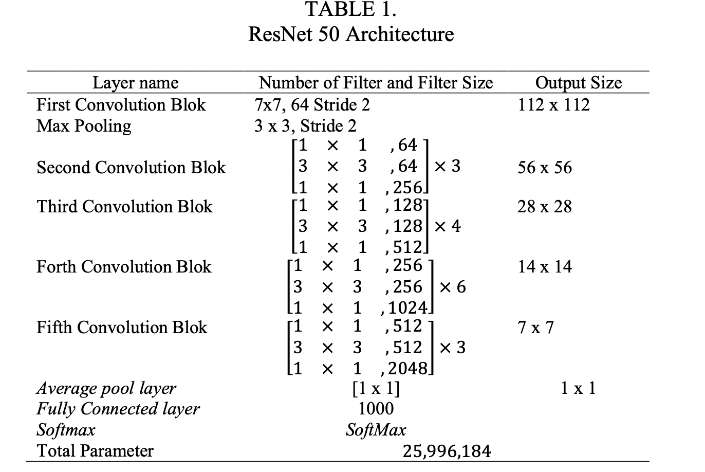

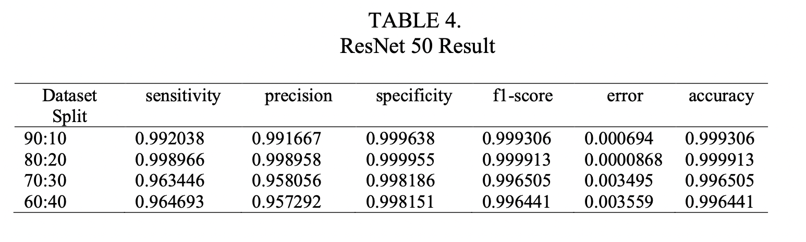

3. DenseNet 121\

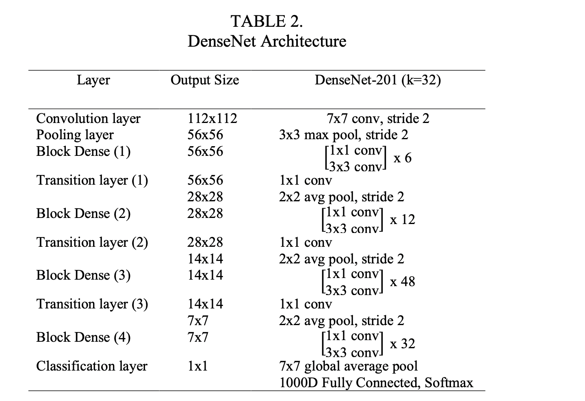

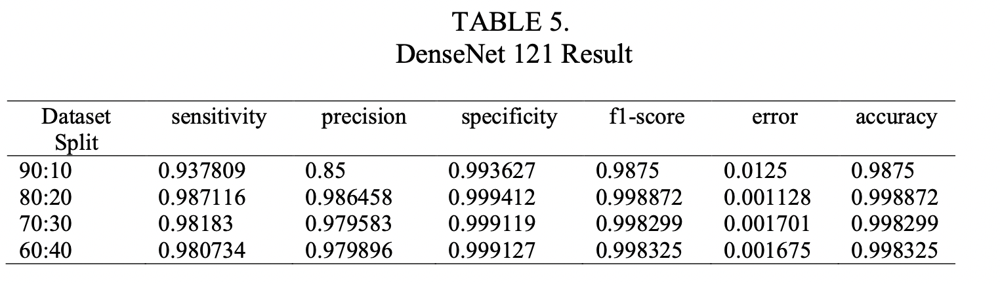

### Article 5 : American Sign Language Recognition using Deep Learning and Computer Vision:  2018 IEEE International Conference on Big Data

1. Approach:  
CNN(inception) to extract spatial features from the video stream for Sign Language Recognition (SLR)\
LSTM (Long Short-Term Memory) [7], a RNN (Recurrent Neural Network) model, to extract temporal features from the video sequences via two methods: Using the outputs from the Softmax and the Pool layer of the CNN respectively.\

2. Related work:   
  - Hidden Markov Models (HMM) to recognize facial expressions from video sequences combined with Bayesian Network Classifiers and Gaussian Tree Augmented Naive Bayes Classifier
  - Kumud et al. frame extraction from video data, pre-processing the data, extracting key frames from the data followed by extracting other features, recognition and finally optimization

3. Key points:  
 pre-trained network as an arbitrary feature extractor

### Article 6 : A novel approach for ISL alphabet recognition using Extreme Learning Machine:
1. Key points:  
  - Discusses some preprocessing steps:
    - Image Resizing, Filtering and threshold based segmentation
    - Edge Detection: Sobel, LOG, Prewitt, Roberts and Canny
    - HOG Features extraction

### Article 7 : Real‑time isolated hand sign language recognition using deep networks and SVD
A comprehensive article with multiple models and feature extraction techniques

Key points:
1. Using g SSD (hand detection), CNN (3D hand pose coordinate estimation), SVD (discriminative hand-related features), and LSTM (handling sequential modeling of features)
2. Using a pretrained model to detect keypoints to estimate a 3d hand pose model.

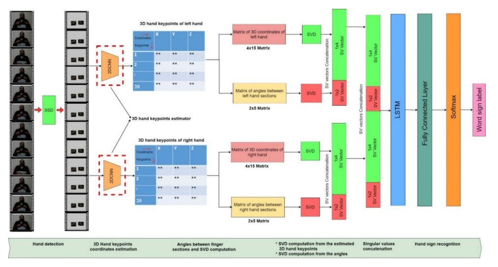

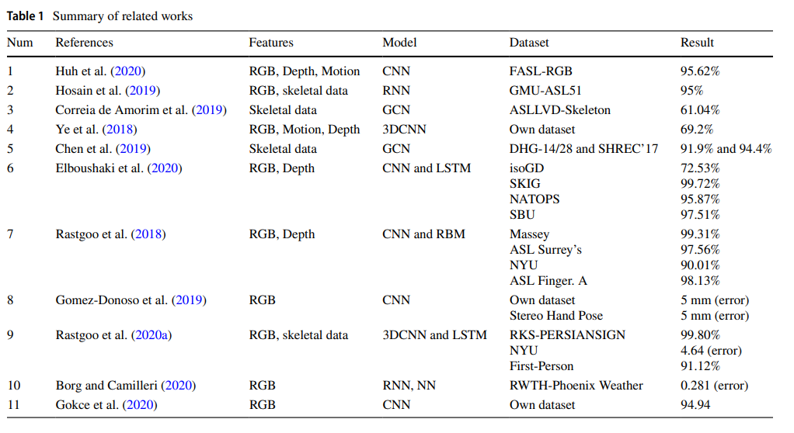

